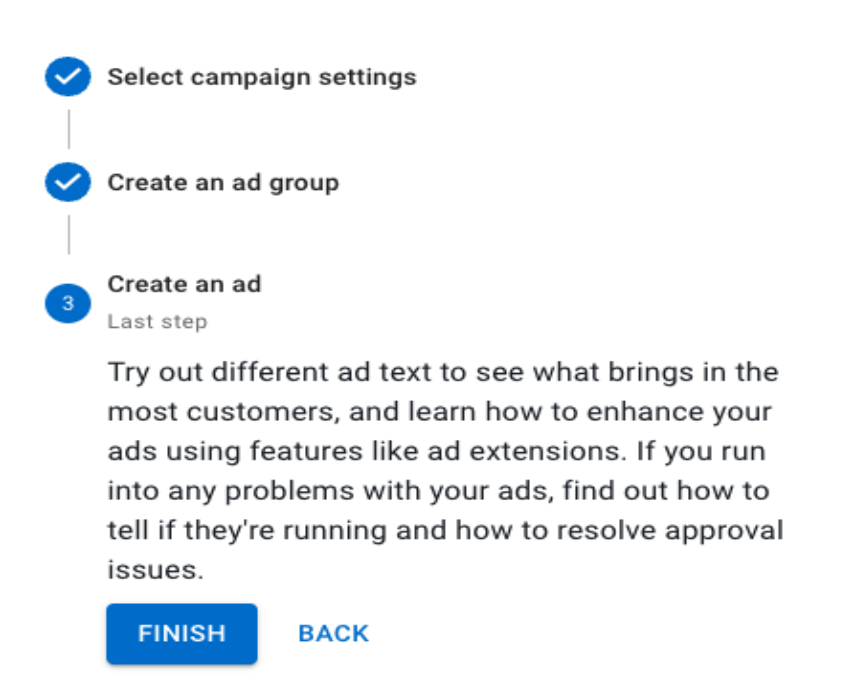

# tyrads_assessment

A new Flutter project for TyrAds Test

## TyrAds Android Developer Test

Problem:
Create a vertical Stepper Component in Flutter using components provided by Flutter SDK itself without using any library.
The data for the stepper should come from native android via a platform channel.
On the Native side, code can be written in either java or kotlin.

Initial State

Final State

Instruction and Time frame:
1. Push the code to GitHub and share the link to the repository.
2. The time frame for you to resolve and send this test is max one week.

